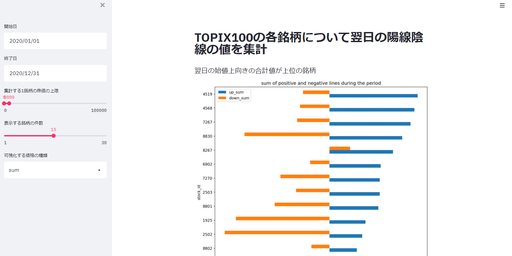

# TOPIX100 の各銘柄について以下の値を集計し、「寄付きが上向き/下向き」かどうかで銘柄の傾向に違いがあるか確認する

##### https://share.streamlit.io/riron1206/stock_up_down_streamlit_app/app.py にアプリデプロイしてる

- matplotlib の日本語化はできなかった...
  - 以下のように packages.txt 用意してもダメだった
  - https://discuss.streamlit.io/t/how-to-use-chinese-font-in-matplotlib-visuals/7895
- デプロイ方法参考: https://tech.ledge.co.jp/entry/2020/10/20/120000

